# 🌿 Just Relax – Sound Mixing & Relaxation App

> A modern **Kotlin Multiplatform** relaxation app that allows users to mix ambient sounds, create custom soundscapes, and relax with a minimal, soft-UI driven experience.

---

## ✨ Key Highlights

- 🎧 Custom ambient sound mixer  
- 🧠 AI-assisted sound mix suggestions  
- ⏱️ Sleep & focus timer  
- 💾 Save & manage favorite mixes  
- 🌗 Light / Dark theme support  
- 🌍 Multiplatform-ready architecture (Android & iOS)

---

## 🛠 Tech Stack

- **Kotlin Multiplatform (KMP)**
- **Jetpack Compose / Compose Multiplatform**
- **Coroutines & Flow**
- **Koin** (Dependency Injection)
- **SQLDelight**
- **Media3 / ExoPlayer**
- **Material Design 3**

---

## 📸 App Gallery

### 📱 Light Theme Screens

<table>
  <tr>
    <th>Home</th>
    <th>Home (Alt)</th>
    <th>Mixer</th>
    <th>Mixer (Alt)</th>
  </tr>
  <tr>
    <td>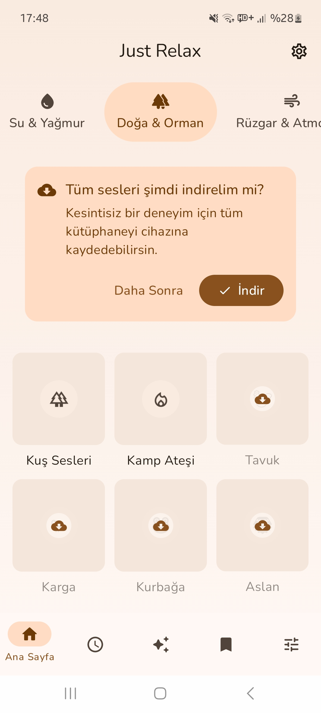</td>
    <td>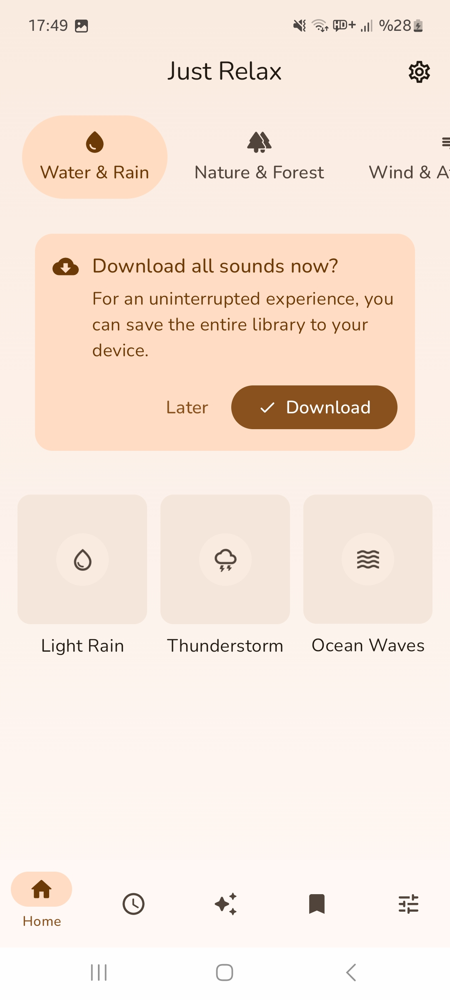</td>
    <td>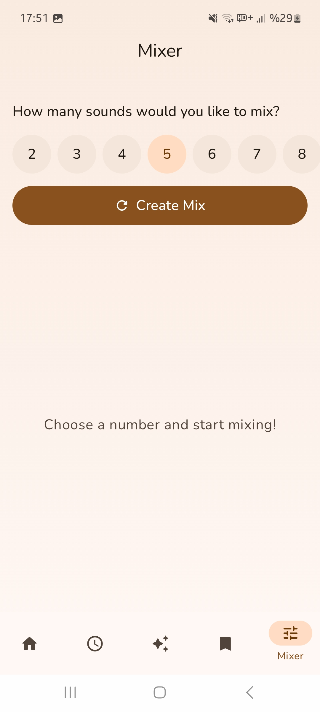</td>
    <td>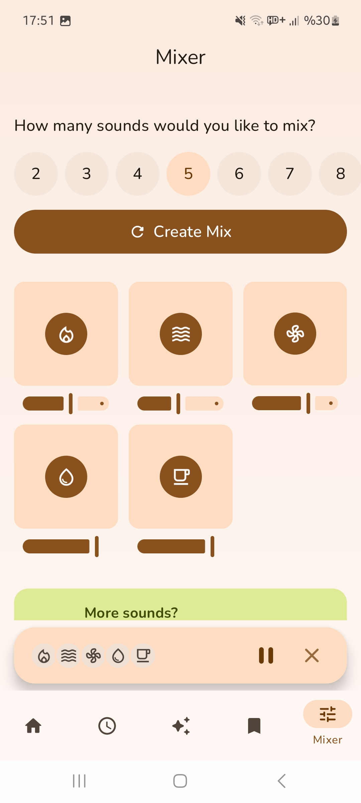</td>
  </tr>
</table>

 

<table>
  <tr>
    <th>AI Suggestions</th>
    <th>AI Suggestions (Alt)</th>
    <th>Saved Mixes</th>
    <th>Saved Mixes (Alt)</th>
  </tr>
  <tr>
    <td>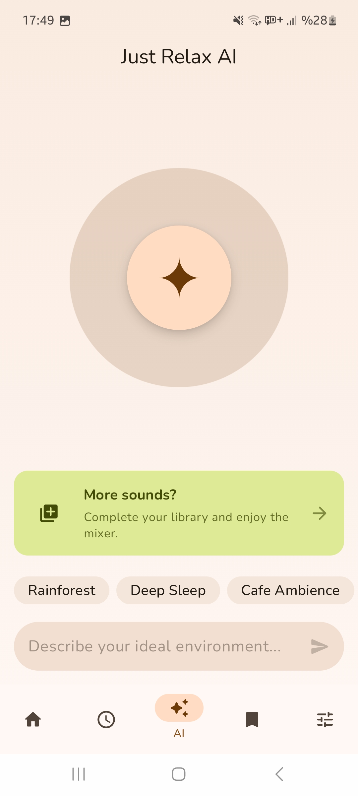</td>
    <td></td>
    <td></td>
    <td>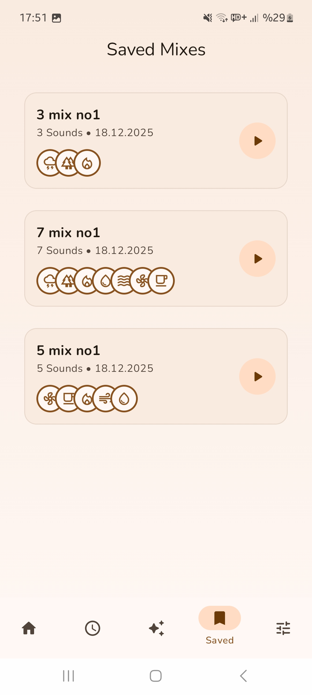</td>
  </tr>
</table>

 

<table>
  <tr>
    <th>Timer</th>
    <th>Timer (Alt)</th>
    <th>Settings</th>
    <th>Settings (Alt)</th>
  </tr>
  <tr>
    <td>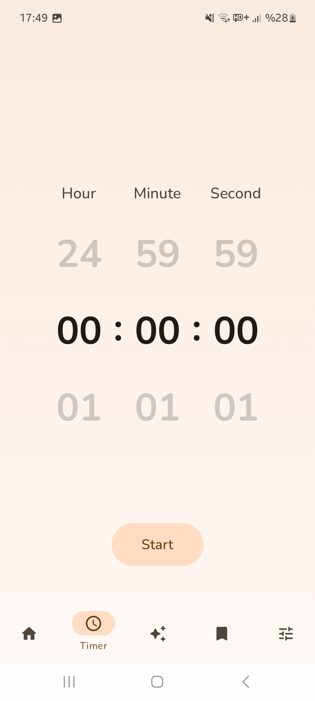</td>
    <td>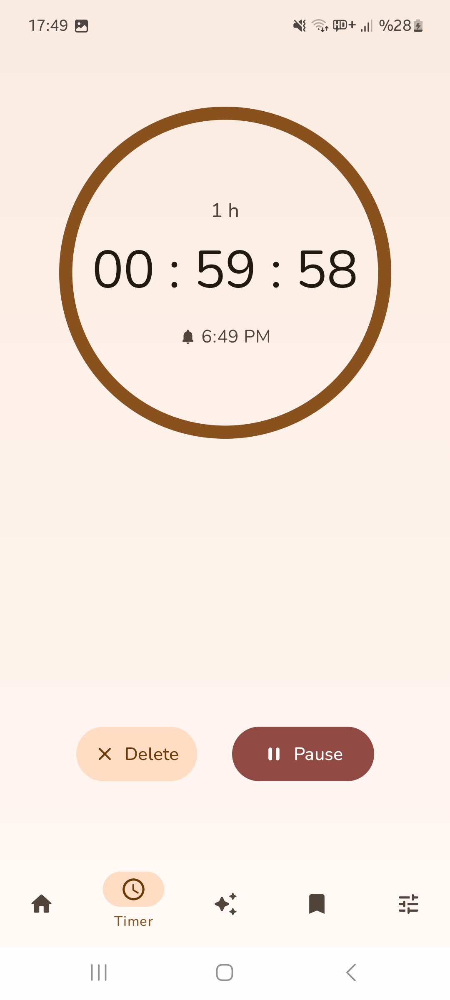</td>
    <td>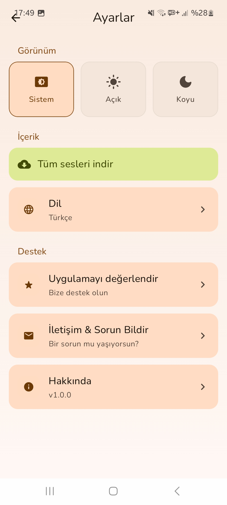</td>
    <td>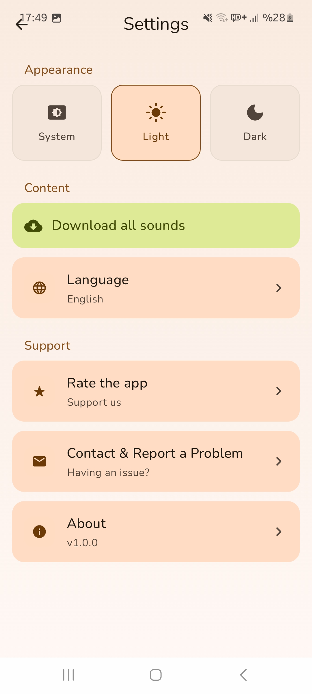</td>
  </tr>
</table>

 

<table>
  <tr>
    <th>Loading</th>
    <th>Coming Soon</th>
    <th>Coming Soon</th>
    <th>Coming Soon</th>
  </tr>
  <tr>
    <td>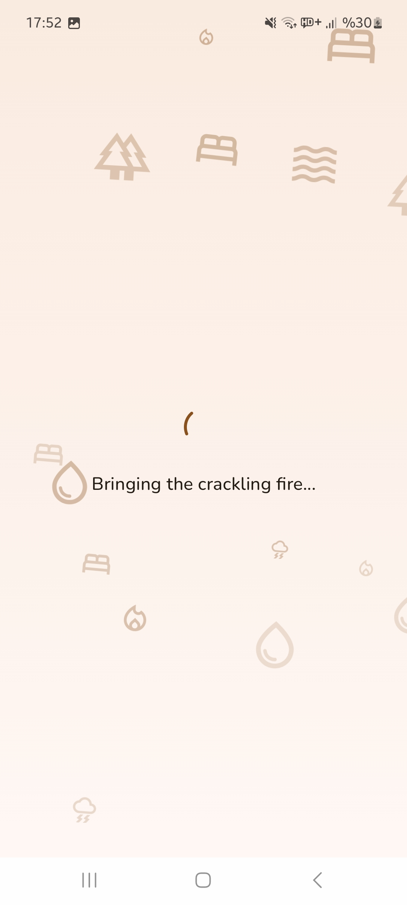</td>
    <td align="center"><i>New states planned</i></td>
    <td align="center"><i>New states planned</i></td>
    <td align="center"><i>New states planned</i></td>
  </tr>
</table>

---

### 📱 Dark Theme (Preview)

<table>
  <tr>
    <th>Settings (Dark)</th>
    <th>Palette Update</th>
    <th>Palette Update</th>
    <th>Palette Update</th>
  </tr>
  <tr>
    <td>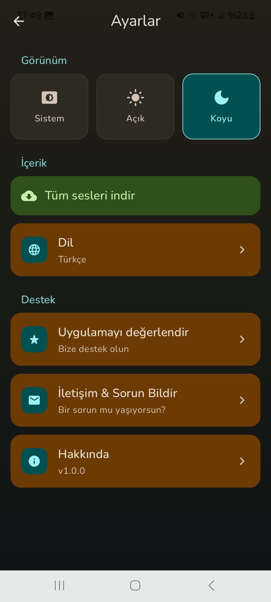</td>
    <td align="center"><i>Color palette refinement in progress</i></td>
    <td align="center"><i>Contrast tuning planned</i></td>
    <td align="center"><i>Additional screens coming soon</i></td>
  </tr>
</table>

---

## 🎥 Feature Demo

Short demo showcasing the overall flow and UX of the application.

- 📹 **Video Demo:** [Watch Just Relax App Preview on YouTube](https://youtube.com/shorts/WNjl-RuWqtQ)
  
---

## 🧱 Architecture Overview

- MVI-inspired state management  
- Clear separation of **UI / Domain / Data**  
- Feature-based modular structure  
- Shared business logic across platforms  

This structure is designed to be **scalable**, **testable**, and **team-friendly**.

---

## 🚧 Known Limitations & Future Improvements

- Offline caching strategies can be expanded  
- iOS UI layer still evolving  
- More AI-driven personalization planned  

This project is actively evolving and serves as both a production-ready base and a learning playground.

---

⭐ *This repository is designed to showcase modern Android & KMP development practices from a junior developer perspective.*
