# 🌿 Just Relax – Sound Mixing & Relaxation App

[](https://kotlinlang.org)
[](https://kotlinlang.org/docs/multiplatform.html)
[](https://developer.android.com/jetpack/compose)
[](https://developer.android.com/topic/architecture)
[](https://developer.android.com/guide/app-bundle/play-feature-delivery)

> A modern **Kotlin Multiplatform** relaxation app where users can mix ambient sounds, create custom soundscapes, and relax with a minimal, soft-UI driven experience.

---

## ✨ Key Highlights

- 🎧 Custom ambient sound mixer  
- 🧠 AI-assisted sound mix suggestions  
- ⏱️ Sleep & focus timer  
- 💾 Save & manage favorite mixes  
- 🌗 Light / Dark theme support  
- 🌍 Kotlin Multiplatform-ready architecture (Android & iOS)

---

## 🖼️ App Gallery (Screenshots)

### 📱 Light Theme (8 Screens)

<table>
  <tr>
    <th>Splash</th>
    <th>Home</th>
    <th>AI</th>
    <th>AI (Alt)</th>
  </tr>
  <tr>
    <td></td>
    <td>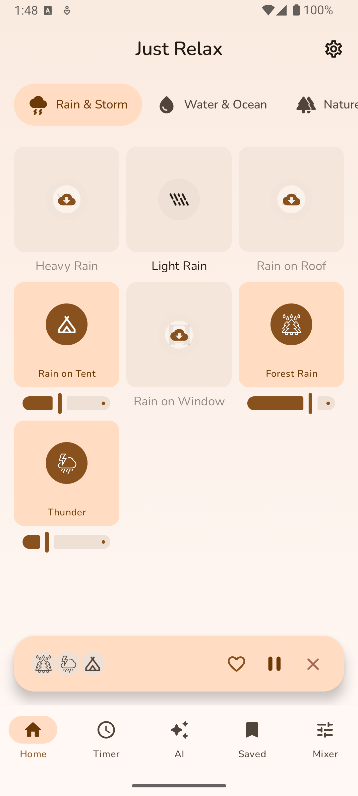</td>
    <td></td>
    <td>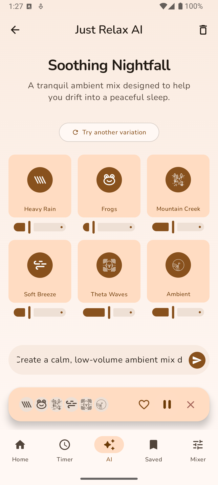</td>
  </tr>
</table>

<br/>

<table>
  <tr>
    <th>Mixer</th>
    <th>Timer</th>
    <th>Saved</th>
    <th>Settings</th>
  </tr>
  <tr>
    <td>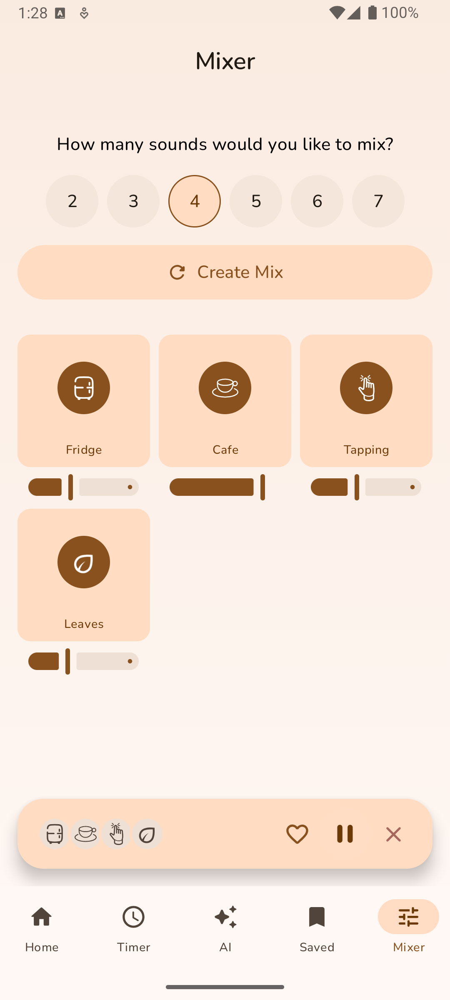</td>
    <td>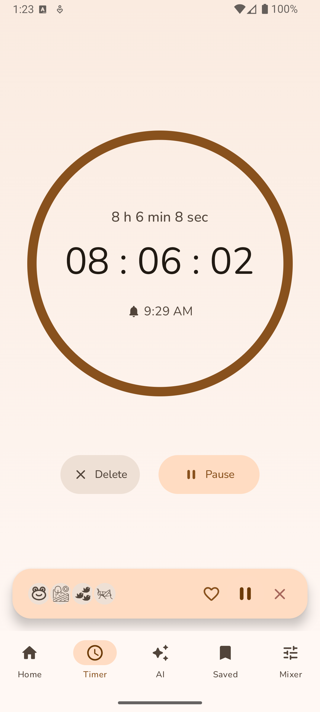</td>
    <td>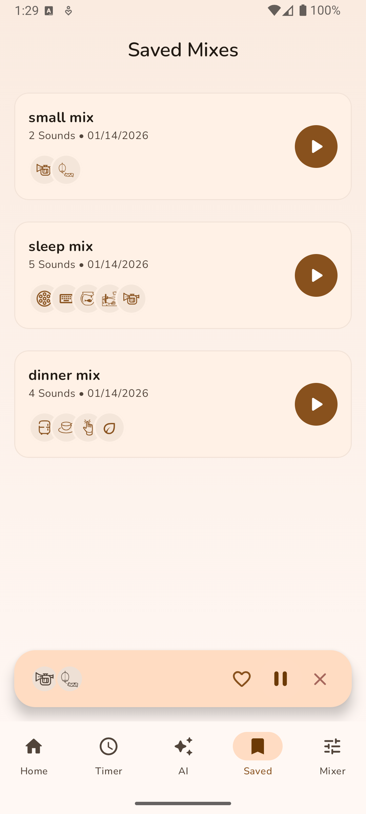</td>
    <td>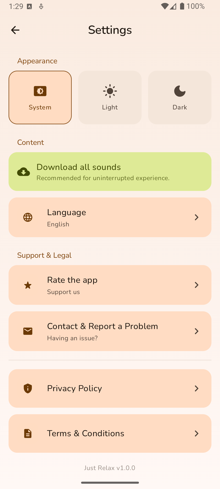</td>
  </tr>
</table>

---

### 🌙 Dark Theme (8 Screens)

<table>
  <tr>
    <th>Onboarding</th>
    <th>Home</th>
    <th>AI</th>
    <th>AI (Alt)</th>
  </tr>
  <tr>
    <td>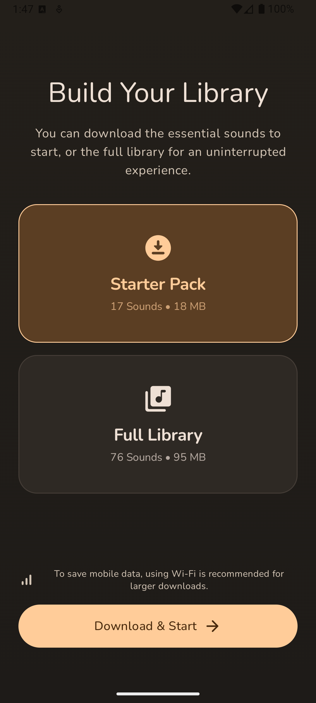</td>
    <td>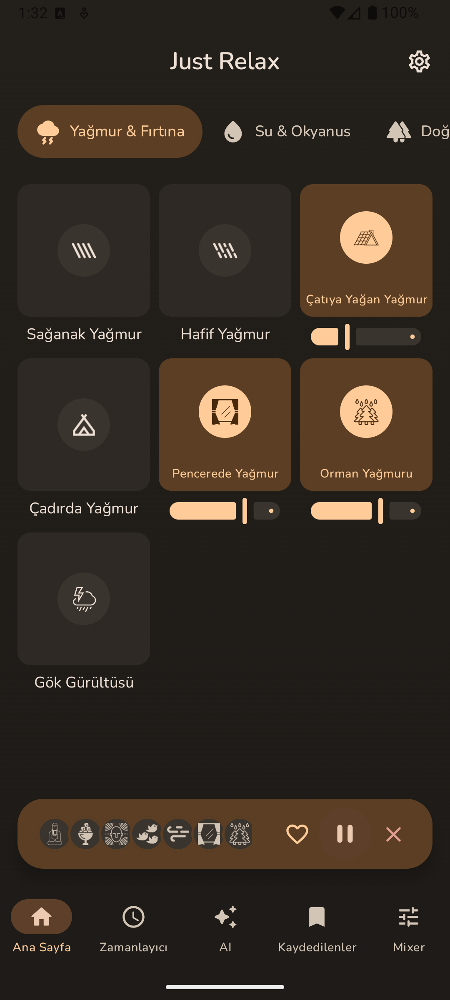</td>
    <td>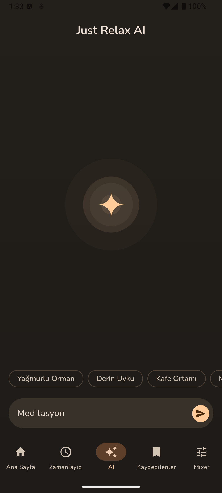</td>
    <td>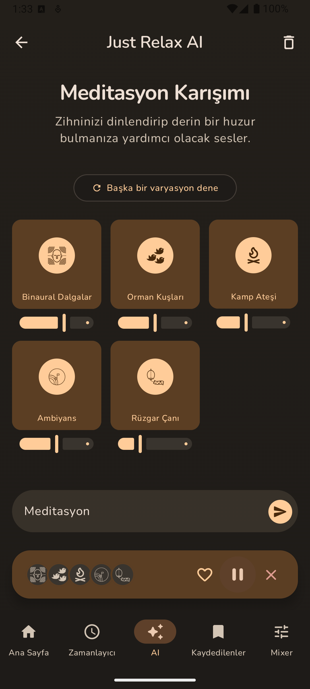</td>
  </tr>
</table>

<br/>

<table>
  <tr>
    <th>Mixer</th>
    <th>Timer</th>
    <th>Saved</th>
    <th>Settings</th>
  </tr>
  <tr>
    <td>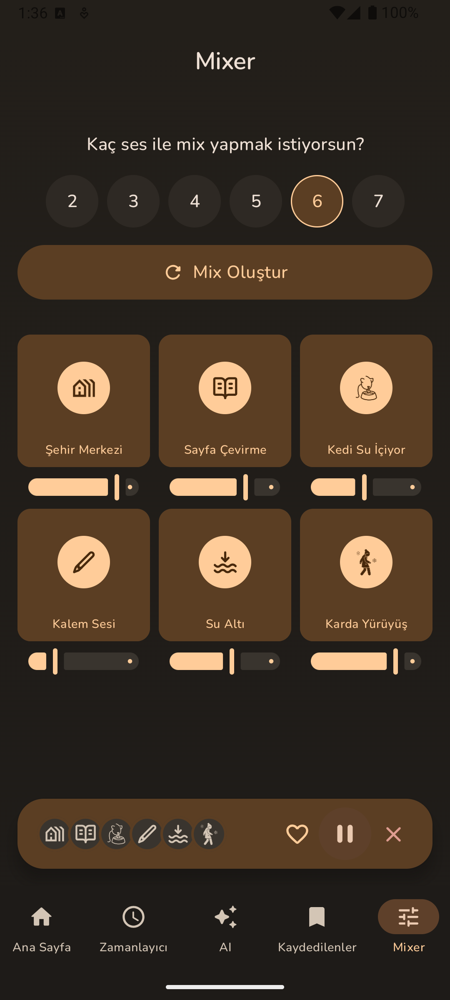</td>
    <td>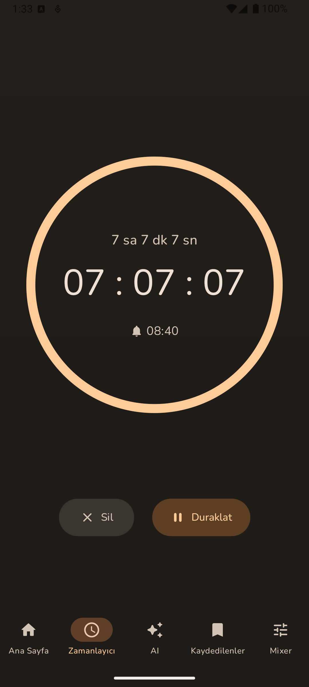</td>
    <td>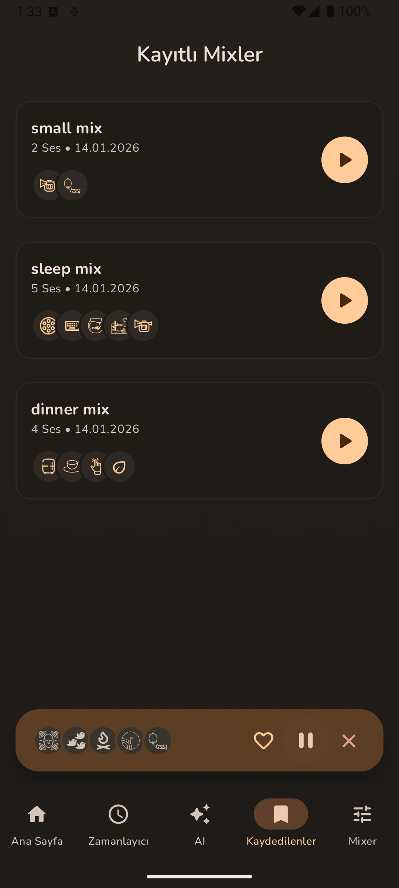</td>
    <td></td>
  </tr>
</table>

---

## 🛠 Tech Stack & Tooling

> Main technologies used in this project, with versions and a short purpose note.

### Core Language & Platform
- **Kotlin Multiplatform** `2.2.21` — shared business logic across Android & iOS  
- **Android Gradle Plugin** `8.11.0` — modern Android build tooling  
- **Compile SDK / Target SDK** `36` · **Min SDK** `29` — modern API support with sensible backward compatibility  

### UI
- **Compose Multiplatform** `1.9.3` — declarative UI  
- **Material Design 3** — consistent design system  
- **AndroidX Activity Compose** `1.11.0` — Compose-first integration  

### State & Concurrency
- **Kotlin Coroutines** `1.10.2` — async + structured concurrency  
- **Flow** — reactive state streams  

### Navigation
- **Voyager** `1.1.0-beta03` — KMP-friendly navigation (lightweight & clean)  

### Dependency Injection
- **Koin** `4.1.1` — Kotlin-first DI with Compose support  

### Networking & Serialization
- **Ktor Client** `3.3.2` — multiplatform HTTP client  
- **Kotlinx Serialization** `1.9.0` — type-safe JSON parsing  

### Persistence
- **SQLDelight** `2.2.1` — type-safe multiplatform database  
- **Multiplatform Settings** `1.3.0` — shared key-value storage  

### Media & Assets
- **Media3 / ExoPlayer** `1.8.0` — audio playback engine  
- **Coil 3** `3.3.0` — image loading for Compose  
- **Okio** `3.16.2` — filesystem & I/O utilities  

---

## 🧩 Modular Architecture (Project Structure)

This project uses a **feature-based modular** architecture to keep the codebase scalable, testable, and easy to maintain.

```text
.
├── build-logic/          # Custom Gradle convention plugins & build tooling
├── composeApp/           # App entrypoint (Android), app-level DI & UI host
├── iosApp/               # iOS entrypoint (iOS host)
├── core/                 # Shared core layer (reusable building blocks)
│   ├── audio/            # Audio abstractions & playback-related core utilities
│   ├── common/           # Shared utilities, helpers, extensions
│   ├── data/             # Data sources, repository implementations, DTOs
│   ├── domain/           # Use-cases, business rules, repository contracts
│   ├── model/            # Shared models
│   ├── navigation/       # Navigation contracts / routes (KMP-friendly)
│   └── ui/               # Shared UI components, theming, design system
└── feature/              # Feature modules (UI + state + feature-specific logic)
    ├── ai/               # AI mix suggestions
    ├── home/             # Home screen
    ├── mixer/            # Mixer screen
    ├── player/           # Global player UI & logic
    ├── saved/            # Saved mixes
    ├── settings/         # Settings
    └── timer/            # Sleep / focus timer
```

### 🧱 Core vs Feature (Quick Map)

**Core modules** — shared, reusable building blocks:

| Core Module | Responsibility |
|---|---|
| `core:audio` | Audio abstractions and core playback utilities |
| `core:common` | Shared helpers, extensions, utilities |
| `core:data` | Data sources + repository implementations |
| `core:domain` | Use-cases, contracts, business rules |
| `core:model` | Shared models (domain models) |
| `core:navigation` | Navigation contracts/routes (KMP-friendly) |
| `core:ui` | Shared UI components + theming/design system |

**Feature modules** — screen-oriented, feature-specific logic (UI + state + integration):

| Feature Module | Responsibility |
|---|---|
| `feature:home` | Home experience |
| `feature:mixer` | Sound mixing workflow |
| `feature:player` | Global player UI + playback coordination |
| `feature:saved` | Saved mixes management |
| `feature:ai` | AI-assisted mix suggestions |
| `feature:timer` | Sleep/focus timer |
| `feature:settings` | Preferences & app settings |

### 🛠 build-logic (Convention Plugins)

The `build-logic` module contains **custom Gradle convention plugins** that standardize configuration across modules, so each new module stays consistent with minimal Gradle boilerplate.

What it standardizes (high-level):
- **Shared Android config:** common `compileSdk / minSdk / targetSdk` defaults  
- **Kotlin / KMP setup:** consistent compiler options and multiplatform target setup  
- **Compose defaults:** Compose Multiplatform setup applied consistently  
- **Common dependency patterns:** repeatable “baseline” dependencies per module type  
- **Build features:** centralized toggles and shared build settings (so modules don’t drift over time)

---

## 🧱 Architecture Overview

- MVI-inspired state management  
- Clear separation of **UI / Domain / Data**  
- Feature-based modular structure  
- Shared business logic across platforms  

Designed with **scalability**, **testability**, and **long-term maintainability** in mind.

---

## 🚧 Known Limitations & Future Improvements

- Advanced AI-driven personalization  

---

⭐ *This repository is crafted to demonstrate modern Android & Kotlin Multiplatform development practices with a strong emphasis on architecture, UI consistency, and thoughtful technology choices.*

---

## 📄 License

Licensed under the **Apache License, Version 2.0**. See the [LICENSE](LICENSE) file for details.

## 🔔 Notice

See the [NOTICE](NOTICE) file for attribution and additional information.
